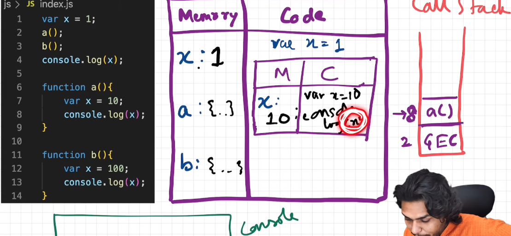
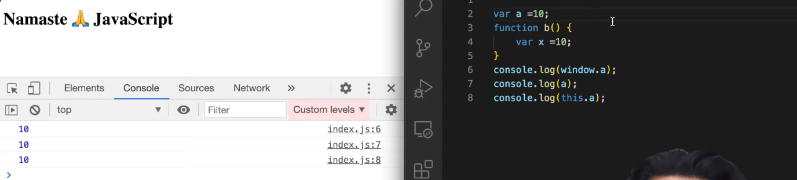
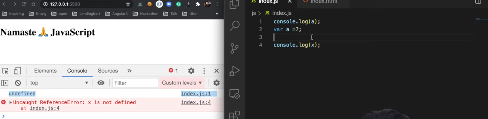
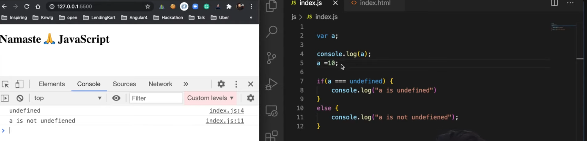
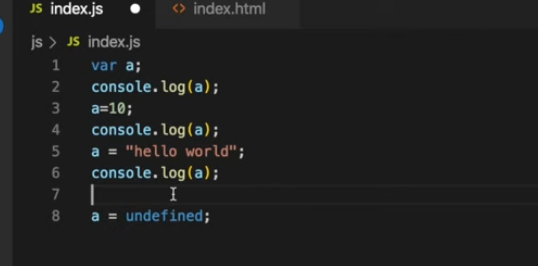
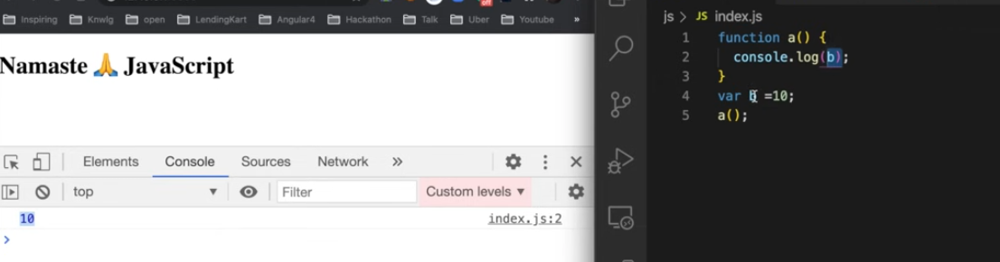
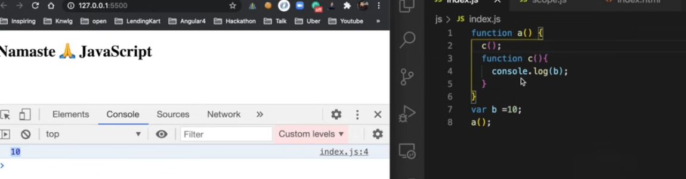
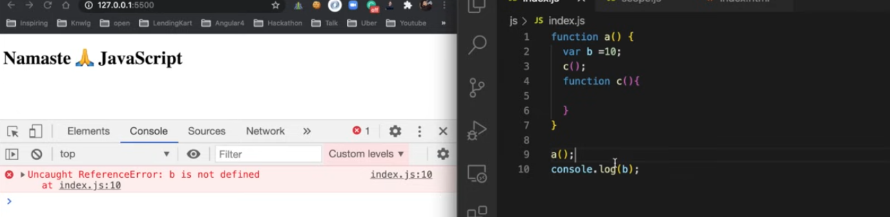
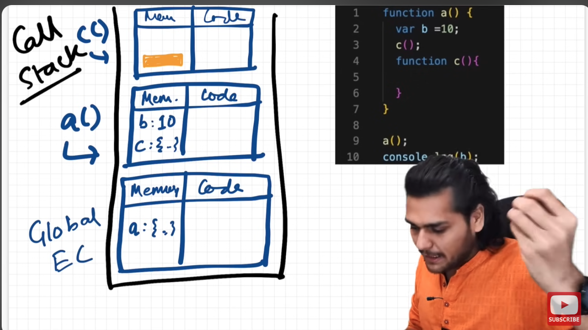

# JavaScript

- [JavaScript](#javascript)
  - [Execution Context](#execution-context)
    - [What happen when you run JavaScript code?](#what-happen-when-you-run-javascript-code)
    - [Call Stack](#call-stack)
  - [Hoisting](#hoisting)
  - [Promises and Async/Await](#promises-and-asyncawait)
    - [Promises:](#promises)
    - [Async/Await:](#asyncawait)
  - [How functions work in JavaScript](#how-functions-work-in-javascript)
    - [Function Invocation:](#function-invocation)
  - [Shortest JavaScript Program](#shortest-javascript-program)
    - [Window Object:](#window-object)
  - [Defined vs Undefined](#defined-vs-undefined)
  - [Scope Change](#scope-change)
    - [Lexical Environment:](#lexical-environment)
    - [Scope Chain:](#scope-chain)
  - [let \& const in JavaScript](#let--const-in-javascript)
    - [Temporal Dead Zone:](#temporal-dead-zone)
    - [Reference Error:](#reference-error)
    - [Syntax Error:](#syntax-error)
    - [Type Error:](#type-error)
    - [How to avoid Temporal Dead Zone?](#how-to-avoid-temporal-dead-zone)

---

**JavaScript Fundamental**: JavaScript is a `synchronous single-threaded` language.

**JavaScript Fundamental**: Everything in JavaScript happens inside an Execution Context

**JavaScript Fundamental**: JavaScript is loosely typed language.

## Execution Context

Execution Context have 2 columns

1. Memory Component (Variable Component) it is where all variables and functions are stored in key-value pair.
2. Code Component (Thread of Execution) it is the place where all code is executed one line at a time, in a specific order.

### What happen when you run JavaScript code?

An execution context is created. Execution context is created in 2 phase.

1. Creation phase/ Memory Creation Phase: All function and variables will be assigned some memory to it. By default variable are assigned as `undefined`. For function it stores the whole function definition.
2. Code Execution Phase: It runs the code line by line and as it runs it assigns the values from the code. For example var `n` which has `undefined` now it will be assigned e.g `2`.

When working with a function in code execution context. It is normal to see another memory creation phase for a function.


[Back to Top](#javascript)

### Call Stack

It's a stack, at the bottom of our stack we have our global execution context, whenever any JavaScript program is run the stack is populated by GEC. Whenever a function is invoked or a bew GEC is created for a function call this will also be pushed inside the stack.


**JavaScript Fundamental**: `Call stack maintains the order of execution of execution context`

## Hoisting

Hoisting is a phenomena in JavaScript in which we can access variables and functions even before we have initialized it without any error, we are doing all this just because of `execution context`.

Example 1:

```javascript
var x = 7;
function getName() {
  console.log("Hello World");
}

getName();
console.log(x);
```

If we see the output we will get: `Hello World` and `7`

Example 2:

```javascript
getName();
console.log(x);

var x = 7;
function getName() {
  console.log("Hello World");
}
```

If we see the output we will get: `Hello World` and `undefined`.

[Back to Top](#javascript)

## Promises and Async/Await

### Promises:

- What are they? Promises handle future events in code. They promise to do something and tell you when it's done or if it failed.
- Benefits: Better than old methods. Make code clean. Good for handling errors.
- Limit: Can be complex for many operations.

### Async/Await:

- What is it? It's a simpler way to use Promises. Makes code look like normal, line-by-line code.
- Benefits: Easier to read and write. Uses try/catch for errors, which is simple.
- Not a Replacement: Async/Await uses Promises. It's just a nicer way to write them.

In short Async/Await made Promises easier. Promises were a big step from older methods. Both are important in JavaScript.

[Back to Top](#javascript)

## How functions work in JavaScript

Functions are first class citizens in JavaScript. They can be passed as arguments to other functions, returned as values from other functions, and assigned to variables.

### Function Invocation:

We can invoke a function without even initializing it and this is because of hoisting.



[Back to Top](#javascript)

## Shortest JavaScript Program

`An empty file is a valid JavaScript program.` This is true because by default JavaScript has a global execution context and it will be pushed to the call stack which will have window object, this pointer and other default objects.

### Window Object:

Window is the global object in client side JavaScript. It is the default object of the browser. It represents the content of the browser window. It is the root of the DOM (Document Object Model). Whenever a global execution context is created it will have window object in it.

- Chrome JavaScript engine is v8. It is the engine that runs JavaScript in the browser. It is written in C++.
- Safari JavaScript engine is Nitro. It is the engine that runs JavaScript in the browser. It is written in C++.
- Firefox JavaScript engine is SpiderMonkey. It is the engine that runs JavaScript in the browser. It is written in C++.

`this === window // true` in case of browser it is window.



[Back to Top](#javascript)

## Defined vs Undefined

`undefined` is a type in JavaScript. It is kind of a placeholder for a variable that has not been defined yet.

Code Example 1 (Undefined):



Code Example 2(Undefined):

.png>)

Code Example 1 (defined):



Never do this (it is not a good practice, as it can lead to bugs):



[Back to Top](#javascript)

## Scope Change

Scope is JavaScript is directly related to lexical environment.

`Scope` means where you can access a specific variable or a function in your code.

### Lexical Environment:

Whenever a global execution stack is created a lexical environment is also created.

`Lexical environment is the local memory along with the lexical environment of its parent`

JavaScript engine will try to find local memory for a variable, if it is not found it will go to the outer environment and so on. This is called lexical environment.

Example 1:



Example 2:



Example 3:
Here in the below example `b` is not defined in the local memory of `c` so we will get an error of `ReferenceError: b is not defined`.



Understanding Lexical Scoping using Call Stack



### Scope Chain:

Scope chain is the order in which JavaScript engine will look for a variable in the lexical environment.

[Back to Top](#javascript)

## let & const in JavaScript

In this module we will study about let and const in JavaScript along with the hoisting, block scope and what is the difference from var

### Temporal Dead Zone:

Temporal dead zone is the time
since when this `let` variable
was hoisted and till it is initialized with some value.

### Reference Error:

If we try to access a variable which is not defined we get Reference Error.
If we are working with `let a` on e.g `line2` and tries to access it on `line 1` we will get a error of Reference Error but with a different message which is `Cannot access 'a' before initialization` it is because of `a` is in Temporal Dead Zone.

### Syntax Error:

If we try to redefine a variable with `let` we will get a syntax error.

```javascript
let a = 10;
let a = 20; // Syntax Error
```

Error: SyntaxError: Identifier 'a' has already been declared

No code will be run if there is a syntax error.

In case of `const` we can't reassign a variable.

```javascript
const a;
a = 20;
```

Error: SyntaxError: Missing initializer in const declaration

### Type Error:

If we try to reassign a variable with `const` we will get a type error.

```javascript
const a = 10;
a = 20; // TypeError
```

Error: TypeError: Assignment to constant variable.

### How to avoid Temporal Dead Zone?

We can avoid Temporal Dead Zone by initializing the variable before we access it.

[Back to Top](#javascript)
