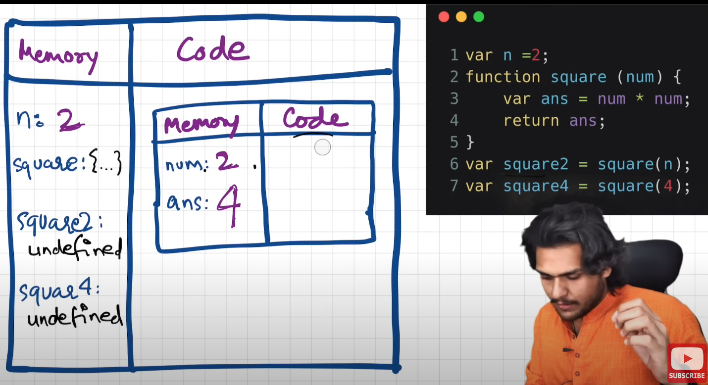
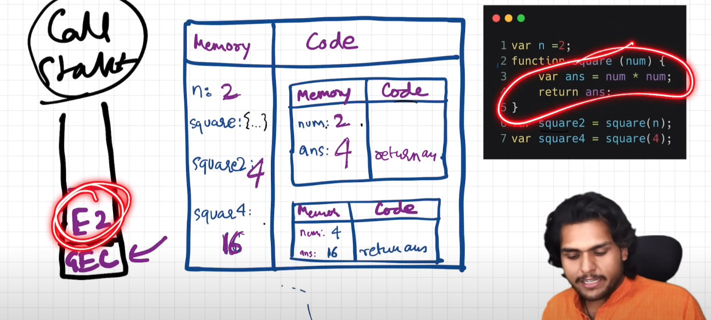

# JavaScript

**JavaScript Fundamental**: JavaScript is a `synchronous single-threaded` language.

**JavaScript Fundamental**: Everything in JavaScript happens inside an Execution Context

## Execution Context:

Execution Context have 2 columns

1. Memory Component (Variable Component) it is where all variables and functions are stored in key-value pair.
2. Code Component (Thread of Execution) it is the place where all code is executed one line at a time, in a specific order.

### What happen when you run JavaScript code?

An execution context is created. Execution context is created in 2 phase.

1. Creation phase/ Memory Creation Phase: All function and variables will be assigned some memory to it. By default variable are assigned as `undefined`. For function it stores the whole function definition.
2. Code Execution Phase: It runs the code line by line and as it runs it assigns the values from the code. For example var `n` which has `undefined` now it will be assigned e.g `2`.

When working with a function in code execution context. It is normal to see another memory creation phase for a function.



### Call Stack

It's a stack, at the bottom of our stack we have our global execution context, whenever any JavaScript program is run the stack is populated by GEC. Whenever a function is invoked or a bew GEC is created for a function call this will also be pushed inside the stack.


**JavaScript Fundamental**: `Call stack maintains the order of execution of execution context`

## Hoisting:

Hoisting is a phenomena in JavaScript in which we can access variables and functions even before we have initialized it without any error, we are doing all this just because of `execution context`

Example 1:

```javascript
var x = 7;
function getName() {
  console.log("Hello World");
}

getName();
console.log(x);
```

If we see the output we will get: `Hello World` and `7`

Example 2:

```javascript
getName();
console.log(x);

var x = 7;
function getName() {
  console.log("Hello World");
}
```

If we see the output we will get: `Hello World` and `undefined`.
