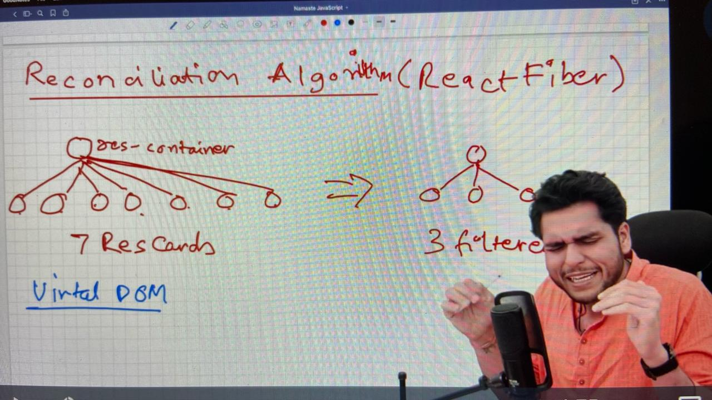

# Laying The Foundations

## Introduction

### How REACT works behind the scenes?

React uses reconciliation algorithm (also known as React Fiber)

Filtered from 7 => 3, React creates a virtual DOM.

#### Virtual DOM

Virtual DOM is not an actual DOM, actual DOM are the tags `
hi
`. Virtual DOM is the representation of actual DOM. Virtual DOM is nothing but like a JAVASCRIPT object (nested object) representation of actual DOM

#### DIff Algorithm:

Diff algorithm finds out difference between 2 virtual DOMS (updated and previous)
